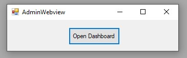
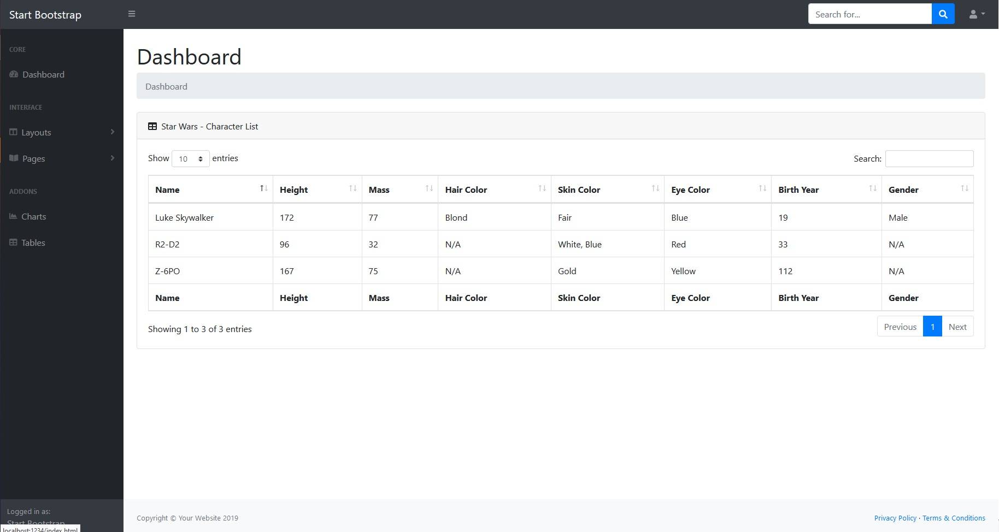

# csharp_grapevine_bootstrap

**<u>Goal</u>**

- I just wanted to have a starting point to distribute via a REST server some "web" files, html, jpg, css, etc.
- The goal is to be able to distribute web views dynamically, using C# runtime variables to fill those views.
- There's a sample that shows, using the *"startbootstrap-sb-admin-gh-pages/dist/index.html"* and *GrapevineBootstrapSampleData.cs* class, how to add dynamic data to a html page as a starter :)
- Good luck!

<u>The Software launches automatically the server & shows the webpage on start</u>

<u>Dynamic values</u>

<u>Default bootstrap template</u>

