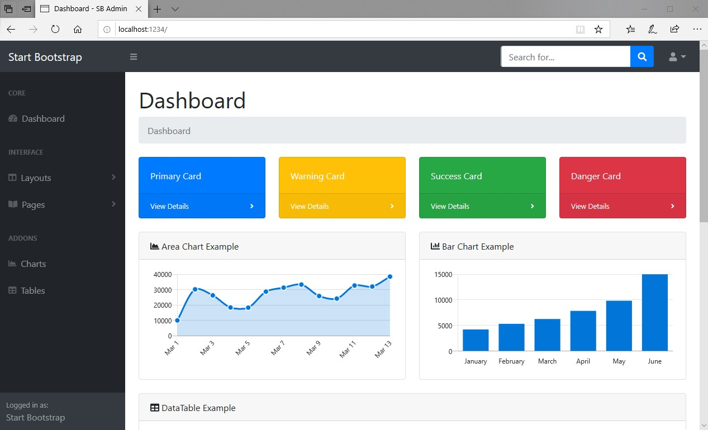

# csharp_grapevine_bootstrap

**<u>Technologies</u>**
- C# / .NET
- Grapevine
- Bootstrap
- js

**<u>Goal</u>**

- I just wanted to have a starting point to distribute via a REST server some "web" files, html, jpg, css, etc.
- The goal is to be able to distribute web views dynamically, using C# runtime variables to fill those views.
- One thing to change, among others, would be to read line by line an html page for example, and identify keys like {DATASET_MY_LIST} and replace it by... idk... a string that contains a standard HTML table and the content of your variable stored & hierarchised in that :)
- Good luck!

